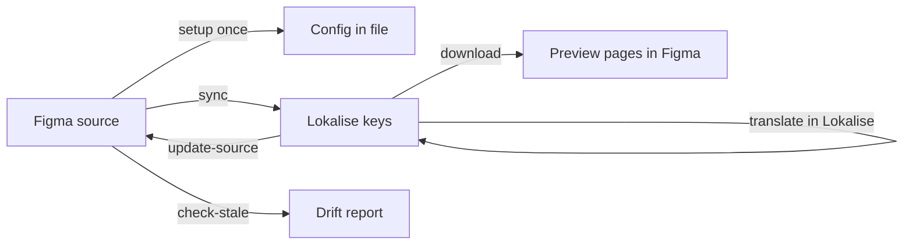

# Localize Figma designs through Lokalise

Design teams often need translated UI before engineering picks up strings. This
skill connects your Figma file to Lokalise so copy moves in both directions:
push source text as translation keys, preview translations in Figma, catch drift,
and pull reviewed copy back into the design.

Built for **designers who use Figma** and are early adopters of **MCP** (Model
Context Protocol). You may already use Lokalise, or be exploring it — either
way, this skill keeps design and translation in sync.

Treat this as a template: configure it once per file, then adapt the skill text
to match how your team uses Figma and Lokalise.

---

## Why localize through a TMS?

Ad-hoc translation — everyone running their own AI translator, copying strings
into spreadsheets, or pasting into separate tools — breaks down quickly on real
product work:

| Problem | With a TMS (Lokalise) |
| --- | --- |
| Different translations for the same string across screens | One key, one approved translation, reused everywhere |
| No review workflow | Linguists, legal, and brand review in a shared queue |
| Copy changes in Figma but nobody updates Lokalise (or vice versa) | Drift detection and structured sync flows |
| Engineering handoff is manual and error-prone | Stable keys and locales, ready for your codebase |

**Figma** is where layout and copy live. **Lokalise** is where languages,
reviewers, and translation memory live. **MCP** lets an AI agent call both as
tools instead of you switching apps. **This skill** tells the agent how to run
the workflow safely.

---

## How it works

Config and link state live **in the Figma file itself** (plugin data) — no
external database. Open the file in any supported agent and it can self-orient
from what's stored there.



| Flow | What you ask for | What happens |
| --- | --- | --- |
| **setup** | "Set up localization for this file" | Links file → Lokalise project, languages, key naming |
| **sync** | "Push this screen to Lokalise" | Creates/updates keys from Figma text (dry-run first) |
| **download** | "Generate German previews" | Clones frames/pages with translated text — source untouched |
| **check-stale** | "Is this up to date?" | Read-only: source drift + missing/outdated translations |
| **update-source** | "Pull reviewed copy from Lokalise" | Updates Figma source text (confirmed per change) |

**Safety:** `check-stale` is read-only. `sync`, `download`, and `update-source`
always confirm before writing — especially when overwriting source text.

---

## Prerequisites

Before any flow runs, you need:

1. A **Figma file** with the screens you want to localize
2. A **Lokalise project** (existing or create one in Lokalise)
3. **Agent access** to Figma and Lokalise — via MCP connectors or in-file tools,
   depending on which package you use (see below)

Connector setup: [`docs/mcp-setup.md`](docs/mcp-setup.md)

---

## Figma native AI skill

Use this if you work **inside Figma's in-product AI agent** (Figma Design or
Figma Make).

### What it does

A **single Markdown file** with everything the agent needs — setup, sync,
download, check-stale, and update-source — folded into one document. Figma's
agent can load one instructions file at a time, not a folder of reference docs.

Runs **inside Figma** using the Plugin API directly. You still need **Lokalise**
connected for key and translation work.

Also supports **plurals** and **rich text** (links, colored spans) on push and
download. See [`docs/governance.md`](docs/governance.md) for how this relates to
the Claude package.

### Download

From GitHub Releases (auto-built from `main`):

**[SKILL.md](https://github.com/silbersteine/figma-lokalise-localization/releases/latest/download/SKILL.md)**

Or clone this repo and use [`figma-agent/SKILL.md`](figma-agent/SKILL.md)
directly.

### Upload to Figma

1. Open Figma Design (or Make) and open the **AI chat** sidebar
2. Click the prompt box → **Skills** → **Add skill**
3. Drag in `SKILL.md` or click **Upload a file**
4. Review the name (`figma-lokalise-localization`) and description → **Add**
5. Invoke with `/figma-lokalise-localization` or describe your task in natural
   language

[Figma's custom skills guide →](https://help.figma.com/hc/en-us/articles/40283639496599-Custom-skills-for-the-Figma-agent-and-Figma-Make)

### Typical commands

**First time on a file**

```
/figma-lokalise-localization Set up localization for this file —
Lokalise project [name or ID], source English, targets de, fr, es
```

**After editing copy in Figma**

```
Push the selected screen to Lokalise — show me a dry run first
```

**Preview translations**

```
Download translations for German and French on this screen
```

**Before a review or handoff**

```
Check if this screen is stale — any drift or missing translations?
```

**Copy was reviewed in Lokalise**

```
Update the Figma source from Lokalise for the selected frame
```

---

## Claude package

Use this if you work in **Claude** (claude.ai, Claude Desktop, Claude Code) or
**Cursor** with MCP connectors.

### What it does

The **canonical multi-file skill** under `skills/figma-lokalise-localization/`:
a router plus reference docs and one file per flow. Designed for agents that can
read multiple files and call MCP tools.

Figma access goes through the **Figma MCP** (`use_figma`). Lokalise access goes
through the **Lokalise MCP**. This is the **source of truth** for behavior and
safety.

### Download

From GitHub Releases:

**[figma-lokalise-localization.zip](https://github.com/silbersteine/figma-lokalise-localization/releases/latest/download/figma-lokalise-localization.zip)**

Or clone this repo — no zip needed if the project includes it.

### Install

**Claude.ai / Claude Desktop (~2 minutes)**

1. Download the zip (link above)
2. **Settings → Capabilities → Skills → Upload skill** — upload the zip as-is
3. Connect the **Figma** and **Lokalise** MCP connectors
   ([`docs/mcp-setup.md`](docs/mcp-setup.md))

**Claude Code (user-level)**

```bash
cp -r skills/figma-lokalise-localization ~/.claude/skills/
```

**Cursor (project-level)**

```bash
cp -r skills/figma-lokalise-localization .cursor/skills/
```

For other agents that read `AGENTS.md`, the repo root file already points at the
skill.

### Typical commands

Natural language is enough — the skill routes from your intent:

| You say | Flow |
| --- | --- |
| "Configure Lokalise for this Figma file" | setup |
| "Create keys from this frame" / "Sync to Lokalise" | sync |
| "Make translated preview pages for Japanese" | download |
| "Did the source change since last sync?" | check-stale |
| "The copy was reviewed in Lokalise — update Figma" | update-source |

**Example session**

```
Here's my Figma file: https://figma.com/design/ABC123/...
Set up localization — project is "Mobile App UI", English source, German and French targets.

[after design edits]
Sync the Checkout screen to Lokalise. Show dry run before writing.

Generate German preview pages for Checkout.

Check stale on the whole file before we ship to translators.
```

If MCP isn't connected, the skill plans the work and tells you what's missing —
it won't claim to have written anything.

---

## Which one should I use?

| | **Figma native skill** | **Claude package** |
| --- | --- | --- |
| **Where you work** | Inside Figma's AI chat | Claude or Cursor |
| **Install** | Upload single `SKILL.md` | Upload zip or copy skill folder |
| **Figma access** | Plugin API in-file | Figma MCP |
| **Lokalise access** | Lokalise tool/API | Lokalise MCP |
| **Rich text / plurals** | Supported | Canonical catching up — see [CHANGELOG](CHANGELOG.md) |
| **Best for** | Designers who live in Figma | Teams on Claude/Cursor with MCP |

Both use the **same storage contract** in the Figma file — config written by one
path is visible to the other.

---

## Make it yours

This skill is a starting point, not a prescription. Every design team works
differently — component libraries, naming conventions, review rituals, which
frames count as "screens," how you use variants and auto-layout, whether copy
lives in components or loose text layers. The skill is meant to bend to *your*
workflow, not the other way around.

### What you can customize without touching code

When you run **setup**, you define defaults that every later flow respects:

- **Key naming** — e.g. `{screen}.{component}.{element}` vs your own pattern
- **Tags and platforms** — match how your org segments keys in Lokalise
- **Target languages** — only the locales you actually ship
- **Preview placement** — where translated clones land (one page per language,
  side by side, etc.)
- **Shared chrome** — nav, footers, and repeated UI that should map to one key
  across screens

Those choices live in the Figma file. Re-run setup anytime your conventions
evolve.

### Adapt the skill instructions

The skill files are plain Markdown — readable, editable, versionable:

| If you use… | Customize by… |
| --- | --- |
| **Figma native agent** | Edit [`figma-agent/SKILL.md`](figma-agent/SKILL.md) before upload — add your design-system rules, crit checklist, or Lokalise tagging policy |
| **Claude / Cursor** | Edit files under [`skills/figma-lokalise-localization/`](skills/figma-lokalise-localization/) — especially `reference.md` (naming, mapping) and individual flows under `flows/` |

Examples of adaptations teams often make:

- **Stricter key naming** — enforce your component naming from the design system
- **Extra metadata on push** — designer notes, char limits, or context fields
  your translators rely on
- **Different preview layout** — match how your team reviews localized UI (e.g.
  always clone next to source)
- **Rich text and plurals** — the Figma-native skill already handles links,
  color spans, and plural forms; port or extend those patterns in the Claude
  package if you need them there too
- **Team-specific safety gates** — e.g. always require dry-run on sync, or limit
  `update-source` to certain frames

Fork the repo, maintain your own copy, or keep a private `SKILL.md` your team
uploads to Figma — whatever fits your governance.

### Lean on Figma the way you already do

The skill reads and writes **text nodes** through the Plugin API. It works best
when your file structure matches how you already design:

- Mark real screens as frames the agent can scope to
- Use consistent layer and component names — they feed key naming
- If you rely on **components and variants**, align naming so keys stay stable
  when variants change
- If you use **styled text** (links, color emphasis), the Figma-native skill
  preserves that on push and download — adjust the rich-text rules in the skill
  if your team uses a different subset

You don't need to redesign your file for the skill. Tune the skill (and setup
defaults) to match the Figma habits you already have.

### Share back (optional)

If you land on a pattern that would help other design teams — a clearer naming
convention, a safer confirmation step, better handling for a Figma feature —
consider opening a PR or describing it in an issue. The canonical skill and the
Figma-native version are maintained as siblings; useful ideas from either side
can flow across. See [`docs/governance.md`](docs/governance.md).

---

## Other agents

The skill is plain Markdown, so anything that can read files and call
Figma/Lokalise tools can run it — not just Claude or Figma's agent.

Paste-in fallback for agents without skill upload:
[`docs/prompt-snippet.md`](docs/prompt-snippet.md)

---

## For maintainers

| Doc | Purpose |
| --- | --- |
| [`docs/governance.md`](docs/governance.md) | Versioning, how the two skill files stay in sync |
| [`docs/mcp-setup.md`](docs/mcp-setup.md) | MCP connector checklist |
| [`CHANGELOG.md`](CHANGELOG.md) | Version history |
| [`AGENTS.md`](AGENTS.md) | Cross-provider router for coding agents |

**Repo layout**

```
skills/figma-lokalise-localization/   canonical skill (source of truth)
figma-agent/SKILL.md                  standalone version for Figma's native AI agent
docs/                                 setup, governance, paste-in fallback
```

**What deliberately stays out of this repo**

- **Session / project artifacts** — key IDs, task IDs, one-off helper scripts,
  specific node IDs. Those belong to the consuming project, not the reusable
  skill.
- **Secrets / API tokens** — never committed; they belong in the agent's MCP
  configuration.
- **Per-file localization config** — lives in Figma plugin data, written by the
  `setup` flow, not in the skill.

## License

[MIT](LICENSE) — confirm this fits your org before publishing (see the note in
the LICENSE file).
